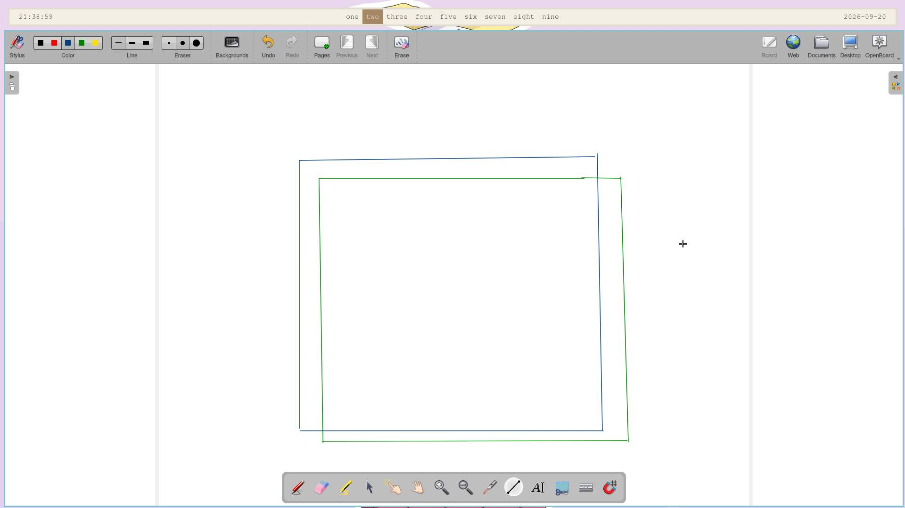

# aro
A tiling window manager for Wayland, built on wlroots. Minimal, flat, one
accent colour, spring-animated.



<!--
Drop demo.mp4 here via the GitHub web editor so it gets hosted properly.
Don't commit the raw video file to the repo.
-->

*aro* is Portuguese for the rim of a pair of glasses. It names the 1px
accent ring just inside every focused border — the one thing on screen that
says "this is the window you are in".

## What it does
- **Tiling, split on demand.** New windows open beside the focused one, or
wherever `mod+v` / `mod+s` said; `dwindle` splits along the longer axis
instead, so the layout spirals on its own.
- **Spatial focus.** `mod+hjkl` moves to the window that is actually up,
left or right on screen, not to the next one in a tree, and across
monitors by the same rule.
- **Drag to rearrange.** Pull a tiled window loose and a preview shows the
slot it would drop into. Drag a border to move the boundary two windows
share — both sides follow the cursor at once.
- **Floating when it matters.** Dialogs and fixed-size windows float on
their own, at the size they asked for; `mod+space` for anything else.
- **One workspace set per monitor**, sway-style, created as you use them.
A VT switch, or unplugging the only screen, keeps layouts and split
ratios intact.
- **Live config.** Saving the file applies immediately; a line that does
not parse says so on screen, with its line number.
- **Window rules**, monitor configuration, an exit prompt, a status bar,
and rounded corners through [SceneFX](https://github.com/wlrfx/scenefx).
Layer shell, XWayland, session lock, idle inhibit, clipboard, drag and
drop, screencopy and xdg-decoration all work.

## Building
Needs **wlroots 0.20**, **SceneFX 0.5**, wayland-protocols, libxkbcommon,
pixman and pangocairo. On Arch:

```sh
pacman -S --needed base-devel meson ninja wayland wayland-protocols \
wlroots0.20 libxkbcommon pixman pango cairo
# scenefx is in the AUR: scenefx or scenefx-git
```

```sh
meson setup build
ninja -C build
```

Options: `-Deffects=false` builds against plain `wlr_scene` — no rounded
corners, no SceneFX needed. `-Dxwayland=disabled` drops X11 support.
`-Dcompositor=false` builds only `aro-layout`, the layout tree's test
harness, which needs no Wayland at all.

## Running
From a TTY:

```sh
./build/aro
```

Nested inside another compositor, to try it out:

```sh
./build/aro -m alt -s foot
```

`-m alt` matters: a host compositor grabs Super before aro ever sees it, so
Super bindings never arrive. `-s` runs a command once the session is up.
Do not debug a crashing build on a TTY — it holds DRM master, and you end
up rebooting.

## Configuration
`~/.config/aro/config`, `key = value`, watched: saving applies it. Copy
[`config.example`](data/config.example) — installed to
`/usr/share/doc/aro/config.example` — and delete what you do not want.

```
mod = super
gaps = 9
accent = 0xe6a54bff
monitor eDP-1 {
scale = auto
position = auto
}
rule = app_id:mpv  workspace 3
rule = app_id:firefox  title:Picture-in-Picture  float
bind = mod+Return, spawn, foot
```

Every window logs `map: app_id="…" title="…"` and every screen logs
`output: name="…" desc="…"` as they appear, which is how you find what to
write a rule or a monitor block against.

### Default bindings
Mod is Super, or Alt with `mod = alt`. The first `bind` line in your config
replaces this table entirely.

| bind | action |
| --- | --- |
| `mod+Return` / `mod+d` | foot / fuzzel |
| `mod+v` / `mod+s` | next window opens right / below (one-shot) |
| `mod+hjkl` | move focus |
| `mod+shift+hjkl` | move the window |
| `mod+ctrl+hjkl` | resize |
| `mod+space` | toggle floating |
| `mod+f` | toggle fullscreen |
| `mod+1..4` | workspace |
| `mod+shift+1..4` | send window to workspace |
| `mod+q` | close |
| `mod+shift+e` | quit (asks first) |
| `mod+drag` | move; a tiled window tears out of the tree |
| `mod+right-drag` | resize |
| drag a header / a border | move / resize, no modifier |

## Not there yet
Pointer constraints and relative pointer (so no FPS games), foreign
toplevel management (so no window list in waybar), `_NET_WM_WINDOW_TYPE`
for X11 splash and utility windows, IPC, blur and shadows, and focus that
crosses between tiled and floating windows.

## License
MIT — see [LICENSE](LICENSE).
