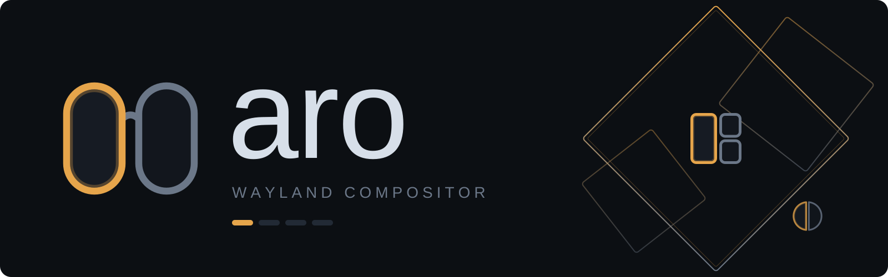

<p align="center">
  
</p>

<p align="center">
  A tiling window manager for Wayland, built on wlroots.<br>
  Minimal, flat, one accent colour, spring-animated.
</p>

<p align="center">
  <a href="https://github.com/simeulinuxkaliaiwr/aro/actions/workflows/build.yml"></a>
  <a href="LICENSE"></a>
  
  
</p>

*aro* is Portuguese for the rim of a pair of glasses. It names the 1px
accent ring just inside every focused border — the one thing on screen that
says "this is the window you are in".

## What it does

- **Tiling, split on demand.** New windows open beside the focused one, or
  wherever `mod+v` / `mod+s` said; `dwindle` splits along the longer axis
  instead, so the layout spirals on its own, and `monocle` shows one
  window at a time without losing the splits underneath.
- **Spatial focus.** `mod+hjkl` moves to the window that is actually up,
  left or right on screen, not to the next one in a tree, and across
  monitors by the same rule.
- **Drag to rearrange.** Pull a tiled window loose and a preview shows the
  slot it would drop into. Drag a border to move the boundary two windows
  share — both sides follow the cursor at once.
- **Floating when it matters.** Dialogs and fixed-size windows float on
  their own, at the size they asked for; `mod+space` for anything else.
- **One workspace set per monitor**, sway-style, created as you use them.
  A VT switch, or unplugging the only screen, keeps layouts and split
  ratios intact.
- **A window switcher.** `mod+tab` walks every window in recently-used
  order; a quick tap swaps back without the card ever appearing.
- **Live config.** Saving the file applies immediately; a line that does
  not parse says so on screen, with its line number.
- **Its own wallpaper**, drawn by `aropaper` at each screen's exact
  resolution, and a status bar that steps aside on its own when waybar or
  quickshell starts.
- **Window rules**, monitor configuration, an exit prompt, and rounded
  corners through [SceneFX](https://github.com/wlrfx/scenefx). Layer shell,
  XWayland, session lock, idle inhibit, clipboard, drag and drop,
  screencopy and xdg-decoration all work.

## Installing

On Arch, from the AUR:

```sh
paru -S aro-git   # or: yay -S aro-git
```

It builds the latest commit and pulls in SceneFX itself.

On Gentoo, from [aro-overlay](https://github.com/simeulinuxkaliaiwr/aro-overlay):

```sh
eselect repository add aro git https://github.com/simeulinuxkaliaiwr/aro-overlay.git
emaint sync -r aro
echo "gui-wm/aro **" >> /etc/portage/package.accept_keywords/aro
emerge -av gui-wm/aro
```

Rounded corners need `USE=effects` and SceneFX from GURU; the overlay's
README has the details.

On NixOS, from this repository's flake:

```nix
# flake.nix
inputs.aro.url = "github:simeulinuxkaliaiwr/aro";

# configuration.nix, with aro passed in as a module argument
imports = [ aro.nixosModules.default ];
programs.aro.enable = true;
```

That installs aro, lists it in your display manager and sets up the
portals. To just try it: `nix run github:simeulinuxkaliaiwr/aro`.
Elsewhere, build it from source as below.

## Building

Needs **wlroots 0.20**, **SceneFX 0.5**, wayland-protocols, libxkbcommon,
pixman and pangocairo; `aropaper` also needs gdk-pixbuf. On Arch:

```sh
pacman -S --needed base-devel meson ninja wayland wayland-protocols \
    wlroots0.20 libxkbcommon pixman pango cairo gdk-pixbuf2 librsvg
# scenefx is in the AUR: scenefx or scenefx-git
```

`librsvg` is only what lets `aropaper` read SVG. Without it the default
wallpaper falls back to the bundled 4K PNG, and SVG wallpapers of your
own will not load.

Screen sharing and screenshots go through `xdg-desktop-portal-wlr`, and
file pickers through `xdg-desktop-portal-gtk`. aro hands its display to
the portals itself, so installing them is all it takes.

```sh
# installing it system-wide
meson setup build --prefix=/usr --buildtype=release
ninja -C build
sudo ninja -C build install

# just building it
meson setup build
ninja -C build
```

Options:

- `-Deffects=false` builds against plain `wlr_scene`: no rounded corners,
  no SceneFX needed.
- `-Dxwayland=disabled` drops X11 support.
- `-Dwallpaper=disabled` skips `aropaper`.
- `-Dcompositor=false` builds only what needs no wlroots: `aro-layout`, the
  layout tree's test harness, and `aropaper`.

## Running

From a TTY:

```sh
aro # if installed, if not: ./build/aro
```

Nested inside another compositor, to try it out:

```sh
aro -m alt -s foot # If not installed, ./build/aro
```

`-m alt` because your main compositor is already using the SUPER key.

### Logs

aro writes its log to `~/.local/state/aro/aro.log` (under
`$XDG_STATE_HOME` if you set it), and the previous session's to
`aro.log.old` — a crash is explained by the log of the session that
crashed, and the next start must not overwrite it. A nested aro writes
`aro-nested.log` instead, so trying a build never pushes your real
session's log aside. Everything also still goes to stderr.

`aroctl log` prints it, so there is no path to remember:

```sh
aroctl log
aroctl log -f
aroctl log --old
aroctl log --path
```

`-f` follows it as it is written, and carries on into the next session
when aro restarts. `--old` is the previous session's log. `--path` only
says where the file is. With aro not running — after a crash, say — there
is nobody to ask, so `aroctl` reads `aro.log` directly and says so.

A different file, or none at all:

```sh
aro -l /tmp/aro.log
aro -l none
```

For a bug report, attach the output of `aroctl log --old` if aro crashed
and you have started it again, and `aroctl log` otherwise.

## Configuration

`~/.config/aro/config`, `key = value`, watched: saving applies it. Copy
[`config.example`](data/config.example) — installed to
`/usr/share/doc/aro/config.example` — and delete what you do not want.

```
mod = super
gaps = 9
accent = 0xe6a54bff
wallpaper = ~/pictures/wallpaper.jpg
cursor_theme = Adwaita
cursor_size = 24
bar = false
monitor eDP-1 {
    scale = auto
    position = auto
}
rule = app_id:mpv  workspace 3
rule = app_id:firefox  title:Picture-in-Picture  float
bind = mod+Return, spawn, foot
```

Every window logs `map: app_id="…" title="…"` and every screen logs
`output: name="…" desc="…"` as they appear, which is how you find what to
write a rule or a monitor block against.

### Wallpaper

aro runs `aropaper` itself, so there is a wallpaper with no config at all.
`wallpaper = auto` is aro's own, a path shows that image (PNG, JPEG or
SVG, covering the screen and cropping the overflow), and `wallpaper = none`
leaves the background to you — `exec = swaybg -i …`, for instance.

Three more come with aro, in `/usr/share/backgrounds/aro/`: `dwindle`,
the layout aro's dwindle mode builds, as a small mark; `rim`, a focused
frame's border and inner ring, tilted; and `lenses`, the logo's glasses.

```
wallpaper = /usr/share/backgrounds/aro/aro-wallpaper-rim-3840x2160.png
```

Each comes as a PNG at 1920x1080, 2560x1440 and 3840x2160, and as an SVG
if you have librsvg.

`aropaper` is an ordinary layer-shell client, so it also works on any compositor that has layer shell — sway, Hyprland, niri and river among them, though not GNOME

```sh
aropaper ~/pictures/wallpaper.jpg
```

### Using another bar

aro's bar hides itself on any screen where another bar is running, so
waybar, quickshell or yambar need no config at all. A bar is recognised by
what it asks for rather than by its name: any layer-shell client that
reserves space along a screen edge counts, which covers bars nobody has
written yet. When the other bar goes, aro's comes back half a second later
— long enough that restarting waybar does not flash it.

`bar = auto` is that behaviour, and the default. `bar = true` keeps aro's
bar beside the other one, which is what you want when the thing reserving
space is a dock or an on-screen keyboard rather than a bar; `bar = false`
never draws it.

Workspace indicators in waybar and quickshell do not know aro yet, so for
now the workspace pills only exist in aro's own bar.

### Default bindings

Mod is Super, or Alt with `mod = alt`. The first `bind` line in your config
replaces this table entirely.

| bind | action |
| --- | --- |
| `mod+Return` / `mod+d` | foot / fuzzel |
| `mod+v` / `mod+s` | next window opens right / below (one-shot) |
| `mod+hjkl` | move focus |
| `mod+shift+hjkl` | move the window |
| `mod+ctrl+hjkl` | resize |
| `mod+tab` / `mod+shift+tab` | window switcher, recently used order |
| `mod+o` | overview: every workspace, zoomed out |
| `mod+t` | cycle this workspace's layout: manual, dwindle, monocle |
| `mod+space` | toggle floating |
| `mod+f` | toggle fullscreen |
| `mod+1..4` | workspace |
| `mod+shift+1..4` | send window to workspace |
| `mod+q` | close |
| `mod+shift+e` | quit (asks first) |
| `mod+drag` | move; a tiled window tears out of the tree |
| `mod+right-drag` | resize |
| drag a header / a border | move / resize, no modifier |

## Getting help

Questions, ideas and setups you want to show off go in
[Discussions](https://github.com/simeulinuxkaliaiwr/aro/discussions).
Bugs go in [issues](https://github.com/simeulinuxkaliaiwr/aro/issues), with the log
attached: `aroctl log --old` if aro crashed and you have started it
again, `aroctl log` otherwise.

## License

MIT — see [LICENSE](LICENSE).
